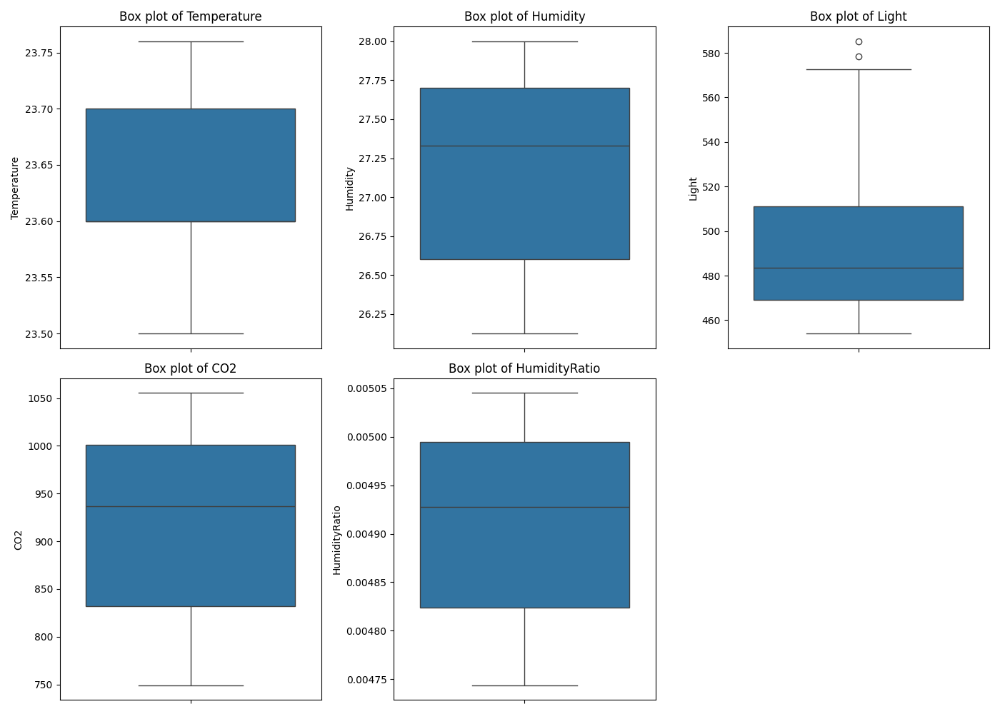

# Descriptive Statistics with Python

This project involves descriptive statistical analysis of a dataset containing environmental measurements. The data includes temperature, humidity, light, CO2 levels, and humidity ratio, along with occupancy status.

## Data Description

### The dataset includes the following columns:

1. **date**: Timestamp of the measurement.
2. **Temperature**: Temperature in Celsius.
3. **Humidity**: Humidity percentage.
4. **Light**: Light level.
5. **CO2**: CO2 concentration in ppm.
6. **HumidityRatio**: Humidity ratio.
7. **Occupancy**: Occupancy status (1 if occupied, 0 if not).

## Goals

+ Calculate descriptive statistics for the dataset.
+ Present box plots of the dependent variables.
+ Interpret the results.

## Descriptive Statistics

### Descriptive statistics involve calculating the following measures for each variable:

* Arithmetic Mean
* Median
* Mode
* First and Third Quartiles (Q1 and Q3)
* Variance
* Standard Deviation
* Coefficient of Variation
* Range
* Skewness
* Kurtosis

## Implementation in Python

The entire analysis will be implemented in Python using pandas, numpy, matplotlib, seaborn, and scipy.stats libraries.

## Box Plots

## Interpretation

- **Arithmetic Mean**: The average value of the data.
- **Median**: The middle value when the data is ordered.
- **Mode**: The most frequently occurring value.
- **First and Third Quartiles (Q1 and Q3)**: Values that divide the data into four equal parts.
- **Variance**: Measure of the dispersion of the data points.
- **Standard Deviation**: Square root of the variance.
- **Coefficient of Variation**: Standard deviation divided by the mean.
- **Range**: Difference between the maximum and minimum values.
- **Skewness**: Measure of the asymmetry of the data distribution.
- **Kurtosis**: Measure of the "tailedness" of the data distribution.

This analysis provides a comprehensive understanding of the data's distribution and variability, helping to identify patterns and insights.

## Further Research
To expand on this analysis, further research will be conducted in JupyterLab using machine learning techniques. This will involve:

* Predictive Modeling: Using the dataset to build models that can predict occupancy status based on environmental measurements.
* Clustering Analysis: Grouping similar data points to identify patterns and anomalies.
* Feature Engineering: Creating new features to improve model performance.
* Model Evaluation: Assessing the accuracy and robustness of different machine learning models.
* Time Series Analysis: Utilizing time series methods to analyze data in the context of their variability over time, identifying trends, seasonality, and other significant temporal patterns.
  
By leveraging machine learning, I can uncover deeper insights and build predictive systems that enhance my understanding and management of environmental conditions.